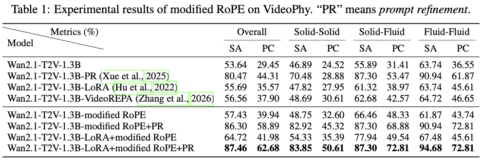
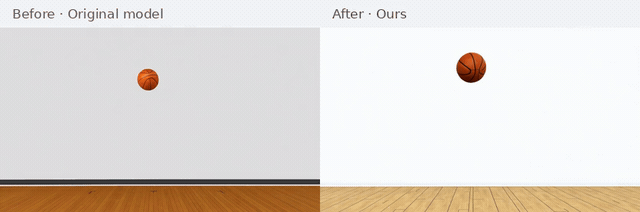
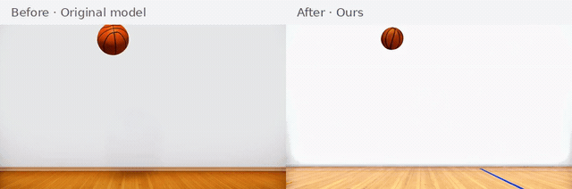
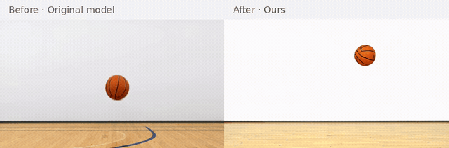
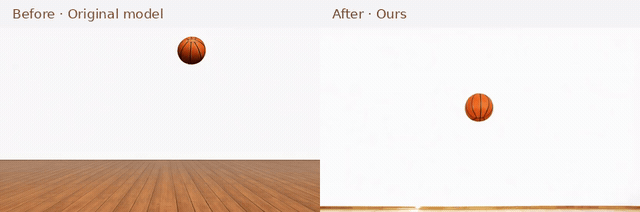
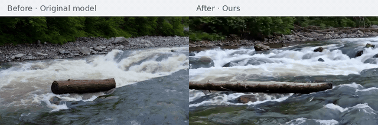
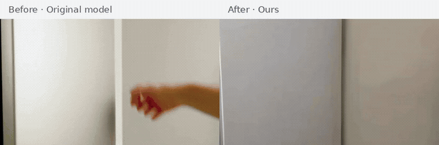
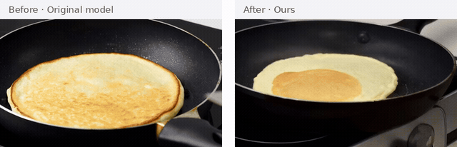
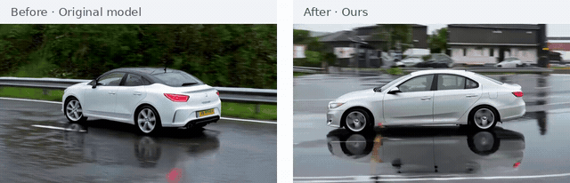

<h1 align="center">Why Do Video Diffusion Models Violate Physics? Unveiling the Flaws in Attention Mechanisms</h1>

<p align="center">
  <b>Yueyan Li</b> · <b>Haibo Wang</b> · <b>Caixia Yuan</b> · <b>Xiaojie Wang</b>
</p>

<p align="center">
  <a href="https://arxiv.org/pdf/2609.23658"></a>
  &nbsp;
  <a href="https://huggingface.co/papers/2609.23658"></a>
</p>

<p align="center"><b>Project Page:</b> <a href="https://siriuslala.github.io/physics/">https://siriuslala.github.io/physics/</a></p>

This repository contains the code for our interpretability study of **motion planning** in text-to-video diffusion models. We analyze how Wan2.1-T2V forms object trajectories during early denoising, locate the attention-head circuits that drive this process, and show that a lightweight RoPE frequency scaling improves physical commonsense.

<p align="center">
  
</p>
<p align="center">
  <em>Figure 1. Same prompt, different seeds. Wan2.1-T2V-1.3B often produces mid-air bouncing, anti-gravity floating, or sudden freezing instead of a physically plausible bounce.</em>
</p>

---

## TL;DR

State-of-the-art video diffusion models look realistic, but they frequently violate basic physics. Existing fixes inject external simulators, rewrite prompts, or add specialized data. We instead look **inside** the model:

1. **Where** does motion planning happen? In the first few denoising steps, visible in object-token cross-attention.
2. **How** does it happen? A small subset of trajectory-forming heads writes motion semantics; self-attention then selects among competing candidate regions.
3. **Why** does it fail? 3D RoPE induces a **spatial anchoring** bias: early, physically wrong positions can suppress better candidates in nearby frames.
4. **What can we do?** Scale the height/width RoPE frequencies with $\lambda^{h/w}<1$ in early steps, with optional LoRA adaptation.

No extra physics simulator, no extra foundation-model teacher, and no change to the official Wan source. All analysis is applied by runtime monkey patches.

---

## Findings

### Motion planning emerges in the first 5 denoising steps

T2V latents are too noisy to decode early on, so we track **video-to-object-token cross-attention**. In 50-step sampling, object locations go from noise to multiple candidate regions to a deterministic trajectory around step 5.

<p align="center">
  
</p>
<p align="center">
  <em>Head-averaged cross-attention in layer 27. The bounce trajectory is already visible by step 7.</em>
</p>

### A clear trajectory pattern is not enough

We score each cross-attention head by **convergence speed** (how fast its map locks onto the final trajectory) and **causal contribution** (attribution patching on the flow-matching velocity in the object region). Zero-ablating heads then reveals four types:

| Type | Trajectory pattern | Contribution | Ablation effect |
| --- | --- | --- | --- |
| (1)(2), excluding layer 0–1 heads | Weak / chaotic | Can be large | Mainly appearance / background |
| (3) | Clear | High | Trajectory collapses |
| (4) | Clear | Near zero | Trajectory almost unchanged |

A clear trajectory pattern is **not sufficient** to identify a motion-planning head: causal contribution and ablation are also needed. Heads in the earliest layers can additionally affect motion initialization without displaying a clear trajectory pattern.

<p align="center">
  
</p>
<p align="center">
  <em>Zero-ablation of the four head types. Ablating Type (3) heads collapses the trajectory; Type (1) also affects motion when layer 0–1 heads are included.</em>
</p>

### Self-attention fails through RoPE spatial anchoring

Cross-attention injects *what* to generate. Self-attention decides *where* the object should be in each frame. Early on, every frame contains several **candidate regions**. Self-attention then votes among them via mutual consistency.

<p align="center">
  
</p>
<p align="center">
  <em>A query region in frame 0 attends to the same spatial coordinate in other frames (RoPE spatial anchoring).</em>
</p>
<p align="center">
  
</p>
<p align="center">
  <em>Multiple candidate regions extracted from early cross-attention.</em>
</p>

Because 3D RoPE decays sharply along height and width, a query prefers spatially nearby keys across frames. If a few frames lock into a physically wrong location first, neighboring frames are pulled toward that same coordinate. Reasonable but more distant candidates lose the competition, producing the failures in Figure 1.

### A one-factor RoPE fix

We keep temporal RoPE unchanged and scale only the spatial axes:

$$
f^{h}(q,p)=q^{h}e^{i p^{h}\lambda^{h}\theta},\qquad
f^{w}(q,p)=q^{w}e^{i p^{w}\lambda^{w}\theta},\qquad \lambda^{h/w}<1.
$$

Smaller $\lambda^{h/w}$ slows spatial attention decay, so early denoising can explore more candidate regions. Training-free inference applies the scale on the first 5 steps. Training-based fine-tuning combines the same scale with LoRA on attention modules and an early-step timestep sampler.

---

## Results

On **VideoPhy** (344 cases; Semantic Adherence / Physical Commonsense, human evaluation):

<p align="center">
  
</p>

The gain is largest on **solid-\*** interactions, which is the regime our analysis targets. Prompt refinement mainly helps instruction following; combining it with modified RoPE further boosts physical consistency.

### Basketball free-fall

Each animation shows **Before: original model (left)** and **After: our method (right)** on a shared timeline.

<p align="center">
  
  <br><em>Basketball free-fall · Seed 8</em>
</p>

<p align="center">
  
  <br><em>Basketball free-fall · Seed 20</em>
</p>

<p align="center">
  
  <br><em>Basketball free-fall · Seed 23</em>
</p>

<p align="center">
  
  <br><em>Basketball free-fall · Seed 29</em>
</p>

### VideoPhy

Each animation shows **Before: original model (left)** and **After: our method (right)** on a shared timeline. A narrow white gap separates the two panels.

<p align="center">
  
  <br><em>Cork being twisted out of a bottle.</em>
</p>

<p align="center">
  
  <br><em>A large log floats downstream in a rushing river.</em>
</p>

<p align="center">
  
  <br><em>Refrigerator door closing after getting a soda.</em>
</p>

<p align="center">
  
  <br><em>Wine pouring from a bottle into a glass.</em>
</p>

<p align="center">
  
  <br><em>Spatula flips pancake in air.</em>
</p>

<p align="center">
  
  <br><em>A car gliding over a road slick with rainwater.</em>
</p>

Full-length, automatically playing MP4 comparisons are available on the [project page](https://siriuslala.github.io/physics/). The original `before.mp4` and `after.mp4` files are preserved in [`assets/videos/`](assets/videos/).

---

## Repository Structure

```text
.
├── index.html               # static project page
├── assets/                  # paper figures, original videos, MP4/GIF comparisons
├── wan21_t2v_experiments/   # interpretability toolkit (monkey patches)
│   ├── docs/                # per-experiment notes
│   └── run_wan21_t2v_experiments.py
├── scripts/                 # launchers for each experiment
├── wan21_train/             # DiffSynth training utilities + RoPE-lambda LoRA
├── wan_eval/                # batch inference on VideoPhy
├── projects/Wan2_1/         # official Wan2.1 inference code (unmodified)
└── DiffSynth-Studio/        # training backend (unmodified)
```

Analysis never edits `projects/Wan2_1`. Every intervention is a runtime patch.

The project page is maintained in this repository. Pushing changes to `index.html`, `assets/`, or the website build configuration to `main` automatically builds and deploys the site through [GitHub Actions](https://github.com/Siriuslala/physics/actions/workflows/pages.yml). Experiment-only changes do not trigger a website deployment. No separate website repository or manual file synchronization is needed.

Project-page preview, media preparation, and publishing instructions: [`wan21_t2v_experiments/docs/project_page.md`](wan21_t2v_experiments/docs/project_page.md).

---

## Setup

```bash
git clone https://github.com/Siriuslala/physics.git
cd physics

conda create -n video python=3.10
conda activate video

# manually install flash attention
bash setup.sh
```

Download [Wan2.1-T2V-1.3B](https://huggingface.co/Wan-AI/Wan2.1-T2V-1.3B) (or the 14B checkpoint) and copy the environment template:

```bash
cp scripts/.env_example scripts/env.sh
```

Set `ROOT_DIR`, checkpoint directory, and output directory in `scripts/env.sh`. The launchers in `scripts/` source this file.

---

## Interpretability Toolkit

Launchers live in `scripts/`. Edit the corresponding `.sh` file, then run it:

```bash
bash scripts/<experiment>_wan2_1.sh
```

A typical analysis path follows the paper:

| Paper section | Script | What it shows |
| --- | --- | --- |
| 4.1 Cross-attention evolution | `scripts/cross_attention_token_viz_wan2_1.sh`, `scripts/head_evolution_wan2_1.sh` | Trajectory appears in the first 5 steps; entropy / support quality |
| 4.2 Motion-planning heads | `scripts/cross_attn_head_ablation_wan2_1.sh`, `scripts/trajectory_consensus_dynamics_wan2_1.sh` | Convergence speed vs. causal contribution; zero ablation |
| 5 Self-attention / candidates | `scripts/self_attention_viz_wan2_1.sh`, `scripts/trajectory_consensus_dynamics_wan2_1.sh` | Candidate-region competition and mutual consistency |
| 5–6 RoPE spatial decay | `scripts/rope_decay_curve_wan2_1.sh`, `scripts/rope_ablation_wan2_1.sh` | Height/width decay vs. temporal decay |

Per-experiment math, flags, and outputs are documented in [`wan21_t2v_experiments/docs/`](wan21_t2v_experiments/docs) and summarized in [`wan21_t2v_experiments/README.md`](wan21_t2v_experiments/README.md).

---

## Training-based RoPE Modification

Training uses DiffSynth-Studio on a filtered subset of [WISA-80K](https://wisav1.github.io/WISA/) (~48k physics videos after duration / motion-score filtering). The recommended recipe is:

- LoRA on self- and cross-attention (`r=64`, `alpha=32`), not FFN
- fixed spatial RoPE scale $\lambda^{h/w}=0.75$ during training
- mixed timestep sampler with $p_{\mathrm{early}}=0.9$ on the first 10% of denoising steps
- at test time, apply $\lambda^{h/w}=0.70$ on the first 5 steps

Prepare metadata:

```bash
python wan21_train/prepare_wisa80k_for_diffsynth.py \
  --extract \
  --build-metadata \
  --metadata-mode categories \
  --merge-category-metadata /path/to/physics_metadata \
  --reflection-sample-n 4000
```

Launch LoRA + fixed-lambda training:

```bash
bash wan21_train/scripts/train_wan21_t2v_1b3_fixed_lambda_lora.sh
```

Details: [`wan21_train/README.md`](wan21_train/README.md) and [`wan21_train/docs/wan21_spatial_rope_lambda_training.md`](wan21_train/docs/wan21_spatial_rope_lambda_training.md).

---

## Evaluation

Edit the settings in `wan_eval/scripts/infer_eval_2.1.sh`, then run:

```bash
bash wan_eval/scripts/infer_eval_2.1.sh
```

Prompt files are under `wan_eval/datasets/`. See [`wan_eval/README.md`](wan_eval/README.md).

---

## Citation

```bibtex
@article{video-physics-attention-2027,
  title     = {Why Do Video Diffusion Models Violate Physics?
               Unveiling the Flaws in Attention Mechanisms},
  author    = {Yueyan Li and Haibo Wang and Caixia Yuan and Xiaojie Wang},
  journal={arXiv preprint arXiv:2609.23658},
  year      = {2027}
}
```
---

## Acknowledgements

This project builds on [Wan2.1](https://github.com/Wan-Video/Wan2.1), [DiffSynth-Studio](https://github.com/modelscope/DiffSynth-Studio), [WISA](https://wisav1.github.io/WISA/), and [VideoPhy](https://github.com/Hritikbansal/videophy).
